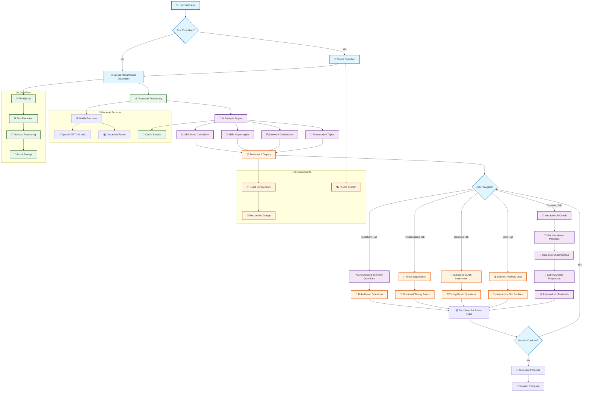

# 🤖 AI Interview Prep

[](https://app.netlify.com/projects/stellular-dasik-f643d9/deploys)

A comprehensive AI-powered interview preparation application that transforms job interview prep with intelligent analysis, personalized coaching, and interactive practice sessions. Built with React, TypeScript, and OpenAI GPT for modern job seekers.

## 📚 Table of Contents

- [✨ Features](#-features)
  - [🎯 Intelligent Interview Coaching](#-intelligent-interview-coaching)
  - [📊 Advanced ATS & Skills Analysis](#-advanced-ats--skills-analysis)
  - [📈 Dynamic Presentation Topics](#-dynamic-presentation-topics)
  - [🚀 Modern User Experience](#-modern-user-experience)
  - [🎭 Stress Relief & Engagement](#-stress-relief--engagement)
- [🚀 Tech Stack](#-tech-stack)
  - [Frontend Architecture](#frontend-architecture)
  - [AI & Backend](#ai--backend)
  - [Development & Deployment](#development--deployment)
- [🛠️ Getting Started](#️-getting-started)
  - [Prerequisites](#prerequisites)
  - [Installation](#installation)
- [🎨 Design System](#-design-system)
  - [Theme System](#theme-system)
  - [Color-Coded Content System](#color-coded-content-system)
- [🔄 Application Flow](#-application-flow)
  - [🔍 Flow Breakdown](#-flow-breakdown)
- [📁 Project Architecture](#-project-architecture)
  - [Component Structure (Atomic Design)](#component-structure-atomic-design)
  - [File Naming Conventions](#file-naming-conventions)
- [⚡ Performance Optimizations](#-performance-optimizations)
  - [AI Response Optimization](#ai-response-optimization)
  - [Caching & Data Management](#caching--data-management)
  - [Frontend Performance](#frontend-performance)
  - [Development Experience](#development-experience)
  - [Testing](#testing)
- [🔧 Configuration](#-configuration)
  - [OpenAI Integration](#openai-integration)
  - [Cookie Consent](#cookie-consent)
- [🚀 Deployment](#-deployment)
  - [Netlify (Recommended)](#netlify-recommended)
  - [Other Platforms](#other-platforms)
- [🤝 Contributing](#-contributing)
- [📄 License](#-license)
  - [Attribution](#attribution)
  - [Third-Party Licenses](#third-party-licenses)
- [🔗 Connect & Follow](#-connect--follow)
- [🎯 Future Roadmap](#-future-roadmap)
  - [Recently Completed ✅](#recently-completed-)
  - [Phase 1: Enhanced User Experience](#phase-1-enhanced-user-experience)
  - [Phase 2: Collaboration & Integration](#phase-2-collaboration--integration)
  - [Phase 3: Mobile & Advanced AI](#phase-3-mobile--advanced-ai)
- [📚 Documentation](#-documentation)

---

## ✨ Features

### 🎯 Intelligent Interview Coaching
- **Enhanced AI Interview Coach** - Practice with an AI that adapts to 8+ different interviewer roles (Technical Lead, Hiring Manager, Recruiter, Program Manager, etc.)
- **Context-Aware Responses** - AI leverages your complete analysis data (ATS score, strengths, improvements, job details) for personalized feedback
- **Personalized Questions** - AI generates interview questions based on your specific resume and target job description
- **Strategic Questions to Ask** - AI-generated questions candidates should ask interviewers, categorized by timing and purpose
- **Real-time Feedback** - Get instant, role-specific suggestions that consider your analyzed strengths and improvement areas
- **Fully Themed Chat Interface** - Modern chat UI that adapts to all 9 themes with smooth animations and responsive design
- **Current Analysis Integration** - Shows existing analysis overview on upload page when available (not on first load)

### 📊 Advanced ATS & Skills Analysis
- **Smart ATS Score Calculation** - Advanced algorithm analyzes how well your resume matches job requirements (0-100 score)
- **Comprehensive Skills Gap Analysis** - Detailed breakdown of strengths and areas for improvement
- **Keyword Optimization** - Identifies matched keywords and suggests missing ones to improve application success
- **Visual Skills Dashboard** - Color-coded skill bubbles and intuitive progress indicators
- **Industry-Specific Analysis** - Tailored feedback based on job sector and role level

### 📈 Dynamic Presentation Topics
- **AI-Generated Topics** - Custom presentation ideas based on your background and target role
- **Structured Talking Points** - Organized, actionable bullet points for each topic
- **Professional Themes** - Beautiful, responsive card layouts with color-coded categorization
- **Export-Ready Format** - Topics formatted for easy presentation preparation

### 🚀 Modern User Experience
- **9 Comprehensive Themes** - Complete theme system with Standard (Light/Dark), Popular (Ocean Blue, Deep Indigo, Forest Green, Warm Sunset, Cool Mint), and Accessible (High Contrast/Low Contrast) themes with smooth transitions
- **Mobile-First Design** - Fully responsive interface optimized for all devices
- **5-Tab Dashboard** - Comprehensive interview prep with Questions, Coaching, Presentations, Strategic Questions, and Skills Analysis
- **Progressive Web App** - Fast loading, offline-capable, and app-like experience
- **Accessibility First** - WCAG 2.1 compliant with screen reader support and keyboard navigation
- **Smart Caching** - Intelligent caching system reduces API calls and improves performance
- **Chat-Style Interface** - Modern card design with asymmetric border radius and intuitive layouts
- **Optimized Layout** - Clean, distraction-free interface with responsive grid system and optimized content width

### 🎭 Stress Relief & Engagement
- **Dad Jokes Integration** - Lighten the mood with family-friendly humor during prep sessions
- **Persistent Joke Caching** - Smart localStorage caching with 7-day expiration across browser sessions
- **Unique Joke Tracking** - Never see the same joke twice with intelligent uniqueness detection
- **Batch API Optimization** - Fetch up to 60 jokes in 2 API calls with proactive prefetching
- **GDPR-Compliant Caching** - Optional local data caching with cookie consent management
- **Session Persistence** - Resume your prep sessions exactly where you left off

## 🚀 Tech Stack

### Frontend Architecture
- **Framework**: React 18 with TypeScript for type safety and modern development
- **Build Tool**: Vite for lightning-fast development and optimized production builds
- **Styling**: Hybrid CSS architecture with CSS Modules + global design system variables
- **State Management**: Zustand for lightweight, scalable application state
- **Component Architecture**: Atomic Design pattern (Atoms → Molecules → Organisms)

### AI & Backend
- **AI Integration**: OpenAI GPT-3.5-turbo-0125 (latest version) for intelligent analysis and coaching
- **Serverless Functions**: Netlify Functions for secure API key management
- **Document Processing**: Advanced PDF parsing with pdfjs-dist and DOCX support
- **Caching Layer**: Intelligent client-side caching with cache invalidation
- **Performance Optimizations**: Batch API requests, optimized token limits, and reduced latency

### Development & Deployment
- **Development**: Hot module replacement, TypeScript strict mode, ESLint + Prettier
- **Deployment**: Netlify with automatic deployments and edge optimization
- **Performance**: Advanced code splitting, lazy loading, and optimized chunk sizes (<1.5MB)
- **Bundle Optimization**: Manual chunking with PDF.js worker separation and vendor splitting
- **Security**: Environment variables, CORS protection, and input sanitization

## 🛠️ Getting Started

### Prerequisites
- Node.js 18+ 
- OpenAI API key (optional - app works with mock data)

### Installation

1. Clone the repository:
```bash
git clone https://github.com/cxm6467/ai-interview-prep.git
cd ai-interview-prep
```

2. Install dependencies:
```bash
npm install
```

3. Set up environment variables:
```bash
# Create .env file
VITE_OPENAI_API_KEY=your_openai_api_key_here
```

4. Start the development server:

**Recommended: Use Netlify Dev (includes functions):**
```bash
netlify dev
```

**Alternative: For mock data development only:**
```bash
npm run dev
```

5. Open [http://localhost:8888](http://localhost:8888) (Netlify dev) or [http://localhost:5173](http://localhost:5173) (Vite only)

Netlify dev automatically handles both the frontend and serverless functions with proper routing.

## 🎨 Design System

### Theme System
The application features a comprehensive 9-theme system designed for accessibility and user preference:

**Standard Themes:**
- **Light** - Clean white background with dark text
- **Dark** - Dark background with light text (default)

**Popular Themes:**
- **Ocean Blue** - Professional blue tones for corporate environments
- **Deep Indigo** - Rich indigo blue tones for professional elegance
- **Forest Green** - Natural green tones for calm focus
- **Warm Sunset** - Orange and yellow tones for energetic sessions
- **Cool Mint** - Blue and cyan tones for refreshing clarity

**Accessible Themes:**
- **High Contrast** - Maximum contrast for better visibility
- **Low Contrast** - Reduced contrast for light sensitivity

All themes feature:
- **Semantic CSS Variables**: Consistent theming across all elements using modern CSS custom properties
- **Zero Static Colors**: All components use theme variables - no hardcoded colors anywhere in the codebase
- **Smooth Transitions**: 0.3s cubic-bezier transitions for seamless theme switching
- **Universal Coverage**: Themes affect ALL application elements including:
  - Page backgrounds (html, body, root)
  - Content containers and cards
  - Form elements (textareas, inputs, buttons)
  - Navigation and header elements
  - AI chat interface (messages, input, scrollbars)
  - Loading overlays and spinners
  - Interactive elements (buttons, links, dropdowns)
  - Skill bubbles and status indicators
  - Toast notifications and alerts
  - File upload components
  - All borders, shadows, and accents
- **WCAG 2.1 AA Compliance**: All themes meet accessibility standards with enhanced contrast ratios (4.5:1 minimum) and verified legibility across all text elements
- **Modern UI**: Dropdown selector with visual theme previews and smooth animations
- **Persistent Storage**: Theme preference saved and restored across sessions
- **Current Analysis Integration**: Smart detection and display of existing analysis data

### Color-Coded Content System
The application features a cohesive color-coded design system:

- **🔵 Blue**: Strengths and positive attributes, role-based questions
- **🟠 Orange**: Areas for improvement, growth-focused questions  
- **🟢 Green**: Keyword matches and success indicators, team and company questions
- **🔴 Red**: Missing keywords and alerts, culture-focused questions
- **🔵 Indigo**: Interview questions and practice, presentations
- **🔷 Teal**: Presentation topics and speaking points

## 🔄 Application Flow

The following diagram illustrates the complete user journey and data flow through the AI Interview Prep application:



### 🔍 Flow Breakdown

**1. Initial Setup & Document Processing**
- User selects theme and uploads resume/job description
- Advanced PDF/DOCX parsing extracts text content
- Files processed through secure Netlify Functions

**2. AI Analysis Engine**
- OpenAI GPT-3.5-turbo analyzes document content
- Calculates ATS compatibility score (0-100)
- Identifies skills gaps and keyword opportunities
- Generates personalized presentation topics

**3. Interactive Dashboard**
- 5-tab interface with comprehensive interview prep tools
- Real-time data visualization with skill bubbles
- Responsive design adapts to all device sizes

**4. AI Coaching Experience**
- 8+ distinct interviewer personas (Technical Lead, Hiring Manager, etc.)
- Context-aware responses using complete analysis data
- Real-time chat interface with smooth animations

**5. Stress Relief & Engagement**
- Dad jokes integration with smart caching (60 jokes, 7-day expiration)
- Persistent progress tracking across sessions
- GDPR-compliant local storage

## 📁 Project Architecture

### Component Structure (Atomic Design)
```
src/
├── components/
│   ├── atoms/                    # Basic UI building blocks
│   │   ├── Button/               # Reusable button with variants
│   │   ├── Card/                 # Container component
│   │   ├── Text/                 # Typography component
│   │   ├── LoadingOverlay/       # Loading states
│   │   └── SkillBubble/          # Skill tags with optimized wrapping
│   ├── molecules/                # Composite components
│   │   ├── FileUpload/           # Drag-and-drop file uploader
│   │   ├── DadJoke/              # Humor integration
│   │   └── CookieConsent/        # GDPR compliance
│   └── organisms/                # Complex, feature-rich components
│       ├── InterviewChat/        # AI coaching interface (lazy loaded)
│       └── Footer/               # Social links and info
├── services/                     # Business logic layer
│   ├── aiAnalysis.ts             # OpenAI integration with timeout handling
│   ├── cacheService.ts           # Performance optimization
│   └── documentParser.ts         # PDF/DOCX file processing
├── store/                        # State management
│   └── appStore.ts               # Zustand store configuration
├── types/                        # TypeScript definitions
│   └── index.ts                  # Comprehensive type system
├── utils/                        # Utility functions
│   └── lazyLoad.tsx              # Component lazy loading utilities
└── netlify/functions/            # Serverless backend
    ├── ai-handler.js             # OpenAI API proxy with CORS
    └── package.json              # Function dependencies
```

### File Naming Conventions
- **Components**: PascalCase directories with index files
- **CSS Modules**: `ComponentName.module.css`
- **Services**: camelCase with descriptive names
- **Types**: Exported from centralized `types/index.ts`

## ⚡ Performance Optimizations

### AI Response Optimization
- **Latest OpenAI Model**: Uses `gpt-3.5-turbo-0125` for fastest response times
- **Optimized Parameters**: Temperature reduced to 0.3 for faster, more consistent responses
- **Smart Token Limits**: Optimized max_tokens (3500/1200) for optimal performance vs quality
- **Request Timeout**: 90-second timeout with proper error handling

### Caching & Data Management
- **Dad Jokes Batch Fetching**: Prefetch up to 60 jokes in 1-2 API calls vs 50+ individual requests
- **Smart Cache Management**: Proactive prefetching when cache runs low (≤5 jokes remaining)
- **Persistent localStorage**: Cross-session joke caching with 7-day expiration
- **Unique Joke Guarantee**: Advanced tracking prevents users from seeing repeat jokes
- **Duplicate Prevention**: Advanced filtering prevents repeated content across sessions

### Frontend Performance
- **Code Splitting**: Lazy-loaded InterviewChat component and optimized chunks
- **Advanced Bundle Optimization**: Intelligent chunk splitting with PDF.js worker (1,068 kB) and library (311 kB) separation
- **Vendor Chunking**: React (160 kB), documents (56 kB), and utilities properly separated for optimal caching
- **Gzip Compression**: Automatic compression and edge optimization via Netlify (300 kB gzipped for PDF worker)
- **Responsive Images**: Optimized assets with proper sizing

### Development Experience
- **Hot Module Replacement**: Instant updates during development
- **Netlify Dev Integration**: Unified development server for frontend and functions
- **TypeScript**: Full type safety with strict mode enabled
- **ESLint + Prettier**: Consistent code quality and formatting
- **Production Logging**: Clean console output with proper error handling and minimal noise

### Testing
- **Framework**: Jest with React Testing Library for comprehensive component testing
- **Coverage**: 97.41% test coverage with comprehensive test suite
- **Type Safety**: TypeScript integration with ts-jest for type-safe testing
- **CI/CD Ready**: Tests run in CI/CD pipeline with coverage reporting

**Available Test Commands:**
```bash
npm test                # Run all tests
npm run test:watch      # Watch mode for development
npm run test:coverage   # Generate coverage reports
npm run test:ci         # CI mode with coverage
```

## 🔧 Configuration

### OpenAI Integration
The app works without an API key using mock data, but for full AI functionality:

1. Get an OpenAI API key from [platform.openai.com](https://platform.openai.com)
2. Add it to your `.env` file as `VITE_OPENAI_API_KEY`
3. The app will automatically switch to live AI responses

### Cookie Consent
The app includes GDPR-compliant cookie consent for caching user data locally. All data stays on the user's device.

## 🚀 Deployment

### Netlify (Recommended)

1. Connect your GitHub repository to Netlify
2. Set build command: `npm run build`
3. Set publish directory: `dist`
4. Add environment variables in Netlify dashboard:
   - `OPENAI_API_KEY`: Your OpenAI API key
5. Deploy!

**Optimized Build Features:**
- Advanced chunk splitting with PDF.js worker separation
- Lazy loading for InterviewChat component
- Gzip compression and edge optimization
- Clean build output with no warnings

### Other Platforms

The app can be deployed to any static hosting service (Vercel, AWS S3, etc.) with serverless function support for the AI backend.

## 🤝 Contributing

We welcome contributions! Please see our [contribution guidelines](https://github.com/cxm6467/ai-interview-prep) for details.

### Ways to Contribute:
- 🐛 Report bugs and issues
- 💡 Suggest new features
- 🔧 Submit pull requests
- 📖 Improve documentation
- 🎨 Enhance UI/UX design

## 📄 License

This project is open source and available under the [MIT License](LICENSE).

### Attribution

This project includes AI-generated code and assistance from Claude (Anthropic). All AI contributions have been reviewed and tested for production use. The codebase is designed to be educational and demonstrates modern React/TypeScript patterns and best practices.

### Third-Party Licenses

This software includes third-party packages with their own licenses. Please refer to the package.json file and node_modules directory for complete license information for all dependencies.

## 🔗 Connect & Follow

### Developer Links
- **LinkedIn**: [Chris Marasco](https://www.linkedin.com/in/chris-marasco-4-/)
- **GitHub Profile**: [@cxm6467](https://github.com/cxm6467)
- **Project Repository**: [ai-interview-prep](https://github.com/cxm6467/ai-interview-prep)

Created with ❤️ by Chris Marasco - Follow for more innovative projects!

---

## 🎯 Future Roadmap

### Recently Completed ✅
- [x] **Strategic Questions to Ask** - AI-generated questions for candidates to ask interviewers
- [x] **Enhanced Dashboard Layout** - 5-tab interface with optimized responsive design
- [x] **Improved UX** - Removed distracting hover effects and optimized content width
- [x] **Performance Optimizations** - OpenAI API speed improvements and batch joke caching
- [x] **Development Experience** - Unified Netlify dev server and improved routing
- [x] **Persistent localStorage Caching** - Cross-session joke storage with 7-day expiration
- [x] **Production-Ready Logging** - Clean console output with professional error handling
- [x] **Open Source License** - MIT License with proper attribution for AI-generated code
- [x] **Console Log Cleanup** - Removed non-essential warning logs for cleaner production experience
- [x] **Light Theme Text Fix** - Improved readability of suggested answers in light theme with enhanced contrast
- [x] **Enhanced Text Contrast** - Improved contrast ratios for secondary/tertiary text and borders in light theme for WCAG AA compliance
- [x] **Single File Upload** - Restricted file upload components to single file selection with clear user messaging
- [x] **Purple to Blue Color Scheme** - Updated primary colors from purple to modern blue for better professional appearance
- [x] **Loading Screen Text Fix** - Improved loading screen text contrast in light theme for better readability
- [x] **Global Text Inheritance Fix** - Fixed white text on white background issue by ensuring proper color inheritance
- [x] **PDF.js Build Warning Suppression** - Suppressed eval warnings from PDF.js library for cleaner build output
- [x] **Chunk Size Optimization** - Adjusted chunk size warning limit to accommodate PDF.js worker requirements (1200 kB)

### Phase 1: Enhanced User Experience
- [ ] **Interview Recording & Playback** - Record practice sessions for self-review
- [ ] **Custom Question Banks** - User-created and community-shared questions
- [ ] **Advanced Analytics Dashboard** - Detailed progress tracking and insights
- [ ] **Multi-language Support** - International user accessibility

### Phase 2: Collaboration & Integration
- [ ] **Team Collaboration Features** - Shared prep sessions and peer feedback
- [ ] **Job Board Integration** - Direct import from LinkedIn, Indeed, etc.
- [ ] **Calendar Integration** - Schedule and manage interview prep sessions
- [ ] **PDF Report Generation** - Exportable analysis and recommendations

### Phase 3: Mobile & Advanced AI
- [ ] **Native Mobile App** - iOS and Android applications
- [ ] **Voice Interview Practice** - Speech recognition and pronunciation coaching
- [ ] **Industry-Specific Models** - Specialized AI coaches for different sectors
- [ ] **Real-time Market Data** - Salary insights and job market trends

---

## 📚 Documentation

- **[CSS Architecture](docs/CSS_ARCHITECTURE.md)** - Complete styling system documentation
- **[API Documentation](docs/API.md)** - Service layer and integration guides (coming soon)
- **[Component Library](docs/COMPONENTS.md)** - Atomic design system documentation (coming soon)
- **[Accessibility Guide](docs/ACCESSIBILITY.md)** - WCAG compliance and testing (coming soon)

---

## 🔝 Quick Navigation

**Get Started**: [Installation](#installation) | [Prerequisites](#prerequisites) | [Configuration](#-configuration)

**Key Features**: [AI Coaching](#-intelligent-interview-coaching) | [ATS Analysis](#-advanced-ats--skills-analysis) | [Theme System](#theme-system)

**For Developers**: [Tech Stack](#-tech-stack) | [Architecture](#-project-architecture) | [Performance](#-performance-optimizations) | [Contributing](#-contributing)

**Deployment**: [Netlify](#netlify-recommended) | [Other Platforms](#other-platforms) | [CI/CD](#development--deployment)

---

*Built with React, TypeScript, and AI to revolutionize interview preparation!* 🚀✨

**[⬆️ Back to Top](#-ai-interview-prep)**